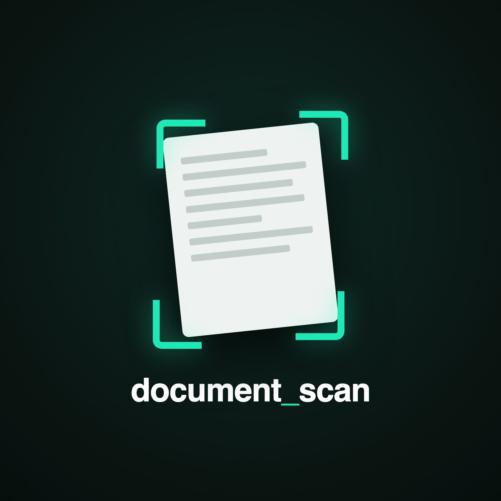
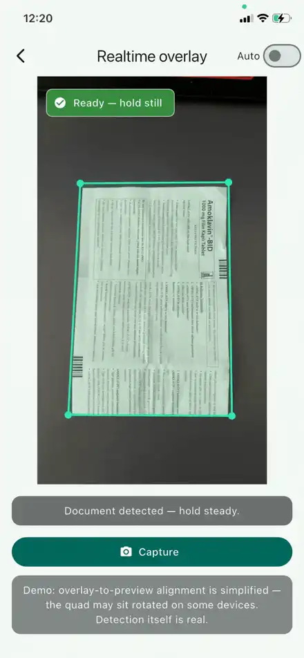
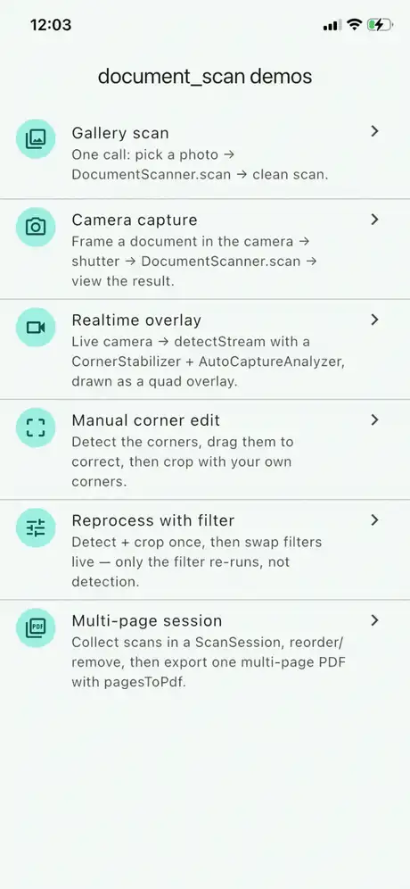
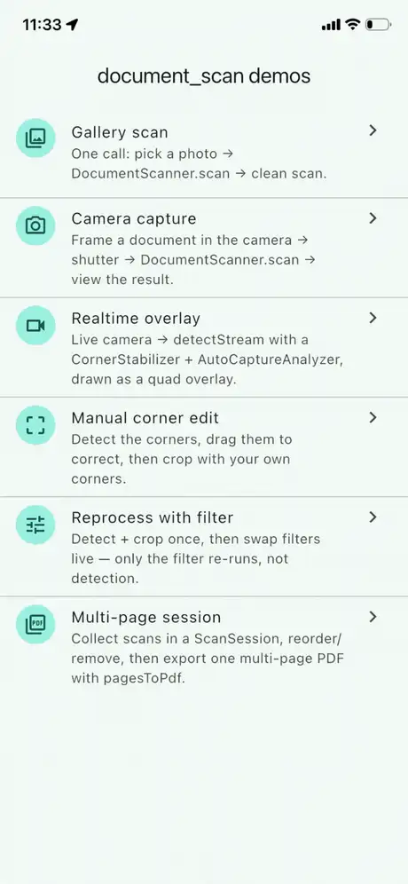
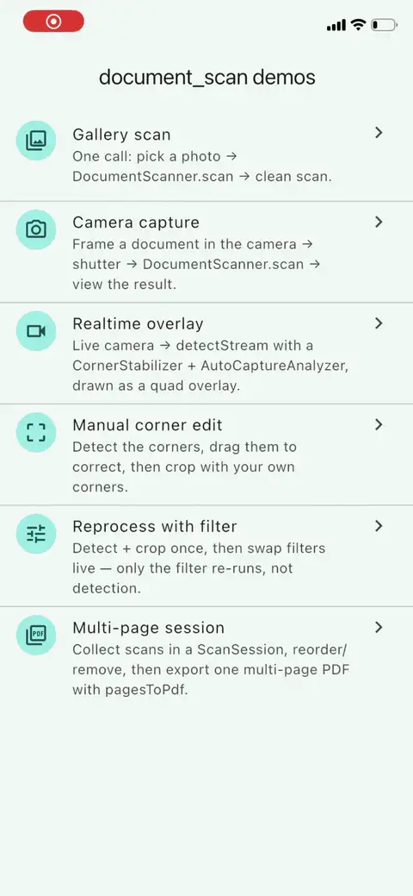
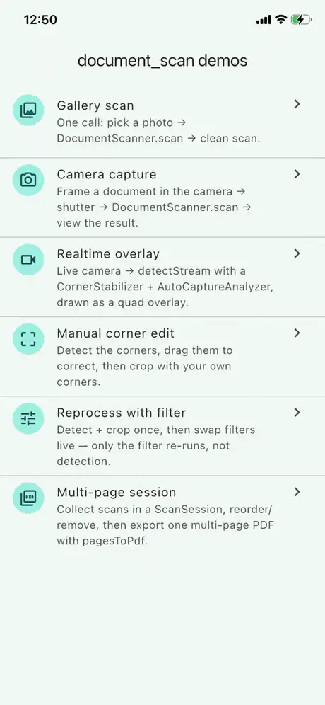

# 📄 document_scan

[](https://pub.dev/packages/document_scan)
[](https://pub.dev/packages/document_scan/score)
[](https://pub.dev/packages/document_scan/score)
[](https://pub.dev/packages/document_scan)
[](LICENSE)


<p align="center">
  
</p>

A composable, native-light document scanner for Flutter. It runs document edge
detection on a photo or a live camera frame, **hands you the four corner
coordinates** (normalized 0..1), then perspective-corrects and filters the crop
into a clean scan. No fullscreen UI — you get the geometry and the pixels.

- 🧩 **Composable, not a black box.** Two independent pieces — a `DocumentDetector`
  that finds corners and a `DocumentProcessor` that warps and filters. Use them
  together, or take just the part you need.
- 🎛️ **Widget-free — returns corner data, not a screen.** You get the four corner
  points and the processed image bytes, so you build the camera UI, the overlay,
  and the "capture" button exactly how you want. (Most scanners hand back a
  cropped file path and their own fullscreen UI.)
- 🪶 **Native-light.** Corner detection uses the platform's own vision engine —
  **Apple Vision on iOS (0 MB)** and **OpenCV on Android** — with no bundled ML
  model, no OCR, and no camera dependency.
- 📐 **Detects documents, not text.** A page is found by its rectangle, so blank
  pages, drawings, and forms work too.

> **Own the camera UX. Keep the scan engine.**
> Not a fullscreen scanner plugin — a document scan engine you drive from your
> own UI.

<p align="center">
  
</p>

## 🤔 Why this exists

Most Flutter document scanners are either locked to a native fullscreen flow
you can't restyle, or a rigid black box that doesn't fit a custom product UX.
`document_scan` gives you the scan pipeline as **data-first APIs** — corners and
pixels — so the camera UI, the overlay, the capture button, and the review
screen are all yours to build.

**It is** a detection + perspective-correction + filtering pipeline.
**It is not** a fullscreen scanner UI, an OCR engine, or a camera package —
bring your own camera and feed it frames or files.

### How it compares

Most Flutter document scanners fall into two camps. Neither lets you own the UI
while staying offline:

| | Fullscreen plugins | ML Kit / VisionKit wrappers | **document_scan** |
| --- | :---: | :---: | :---: |
| Build your own UI (headless) | ❌ | ❌ | ✅ |
| Works fully offline (no Play Services) | ⚠️ varies | ❌ downloads at runtime | ✅ |
| Realtime live-frame detection | some | ❌ still capture only | ✅ |
| Composable detector + processor | ❌ | ❌ | ✅ |
| Returns data (corners + bytes), not a screen | ❌ file paths | ❌ file paths | ✅ |
| Manual corner adjustment | ⚠️ | ❌ | ✅ |

The ML-Kit-based wrappers download their models and scanning UI through Google
Play Services at first run — great for a drop-in screen, but not offline, not
customizable, and (for the document scanner) Android-only. The fullscreen
plugins render their own UI and hand back cropped file paths, not geometry.
`document_scan` gives you the geometry and pixels and gets out of your way.

## 💡 Best for

- Custom banking / KYC capture flows
- Receipt and invoice scanning
- Form and document capture
- Apps with their own embedded camera UX
- Gallery-import + manual-correction workflows

## 🔧 How it works

The two pieces are independent — `DocumentScanner` just ties them together:

```text
  ScanInput          DocumentDetector          DocumentProcessor
  (file / bytes  ──▶  native vision     ──▶     warp + filter    ──▶  ScannedDocument
   / camera frame)    → corners (0..1)                                 (png/jpeg/pdf)
                              │                        ▲
              (A) automatic ──┘   (B) user drags corners┘

  Live camera:  frames ──▶ detectStream ──▶ DetectionEvent
                                │
                                ├──▶ CornerStabilizer   (steady overlay)
                                └──▶ AutoCaptureAnalyzer (auto-shoot)
```

Two ways to crop a still image:

- **(A) Automatic** — `scanner.scan(input)` detects the corners and returns the
  finished scan in one call. The user never touches the corners.
- **(B) User-corrected** — show the detected corners, let the user drag them,
  then `scanner.scan(input, corners: edited)` crops with exactly those.

## 📦 Install

```yaml
dependencies:
  document_scan: ^0.2.1
```

## 🖼️ Scan a still image

<p align="center">
  
</p>

The one-call path — `DocumentScanner` detects the corners and returns a clean,
upright scan:

```dart
import 'package:document_scan/document_scan.dart';

final scanner = DocumentScanner();

final scan = await scanner.scan(ScanInput.file('/path/to/photo.jpg'));
// null when no document-like rectangle is found.
if (scan != null) {
  // scan.bytes is a PNG by default — show it with Image.memory, save it, …
  Image.memory(scan.bytes);
}
```

Pick a filter or a different output encoding:

```dart
final pdf = await scanner.scan(
  ScanInput.file(path),
  filter: ScanFilter.enhance,       // clean "scanned" look (the default)
  output: ScanOutputFormat.pdf,     // or .jpeg / .jpegAt(92); default is PNG
);
// pdf!.bytes is now a single-page A4 PDF.
```

Already have user-corrected corners (e.g. from a drag-to-adjust overlay)?
Pass them and detection is skipped:

```dart
final scan = await scanner.scan(input, corners: editedCorners);
```

<p align="center">
  
</p>

> **Stays off the UI thread.** The warp is pure-Dart CPU work (≈1s on a
> full-frame photo), so `scan` runs it on a background isolate by default — you
> don't need `compute`/`Isolate.run`. Pass `background: false` if you're already
> calling from your own background isolate.

### …or compose the pieces yourself

`DocumentScanner` is a thin tie between two independent pieces you can use on
their own — a `DocumentDetector` (finds corners) and a `DocumentProcessor`
(warps + filters).

**Which API should I use?**

| Goal | Use |
| --- | --- |
| Quickest path — detect + crop in one call | `DocumentScanner` |
| Just find the corners (draw them, confirm, adjust) | `DocumentDetector` |
| Crop/filter with corners you already have | `DocumentProcessor` |
| Watch a live camera stream for documents | `DocumentDetector.detectStream` |
| Decide when a held document is steady enough to shoot | `AutoCaptureAnalyzer` |

```dart
final detector = DocumentDetector();
final processor = const DocumentProcessor();

final input = ScanInput.file('/path/to/photo.jpg');

// 1. Find the document's four corners (normalized 0..1, ordered TL/TR/BR/BL).
final corners = await detector.detect(input);

if (corners != null) {
  // 2. Perspective-correct + filter into an upright scan. Pass background: true
  //    to run the warp on an isolate (the primitive defaults to foreground, so
  //    it composes with your own threading; scan() opts in for you).
  final scan = await processor.crop(
    input,
    corners,
    filter: ScanFilter.enhance,
    background: true,
  );
  // scan!.bytes — save it, show it with Image.memory, …
}
```

## 🎥 Scan from a live camera stream

The package never opens a camera. Feed it frames from your own capture (e.g. the
[`camera`](https://pub.dev/packages/camera) package) as `ScanInput`s. Each frame
yields a `DetectionEvent` so you can tell *why* a frame had no corners — no
document, a dropped frame under load, or a detection error — instead of a
blind `null`:

```dart
final subscription = detector
    .detectStream(myCameraFrames) // Stream<ScanInput>
    .listen((event) {
      switch (event) {
        case DetectionSuccess(:final corners):
          setState(() => _corners = corners); // draw in your overlay
        case DetectionEmpty():
          setState(() => _corners = null);    // hint: "point at a document"
        case DetectionSkipped():
          break; // normal backpressure under load — ignore
        case DetectionError(:final error):
          debugPrint('detect failed: $error'); // stream stays alive
      }
    });
```

### Steady overlay (corner stabilization)

Raw corners jitter a pixel or two every frame even for a still document. Pass a
`CornerStabilizer` to smooth them for the overlay — an exponential moving
average that damps jitter but still tracks real movement, and snaps (rather than
slides) when the document jumps:

```dart
detector.detectStream(myCameraFrames, stabilize: CornerStabilizer());
// DetectionSuccess.corners are now smoothed. Tune CornerStabilizer(smoothing:,
// resetDistance:) for steadier-but-laggier vs snappier.
```

### Detection rate & sensitivity

A camera pushes 30–60 frames a second, but running native detection on every one
just heats the device without a smoother overlay. Cap the rate with `minInterval`
— a frame that arrives too soon is dropped (as a `DetectionSkipped`) before it
reaches the engine. `sensitivity` tunes how eagerly a rectangle counts as a
document: `detectStream` defaults to `strict` (fewer false locks on tabletops and
shadows while framing), `scan()` to `lenient` (the user already committed to a
document), `detect()` to `balanced`.

```dart
detector.detectStream(
  myCameraFrames,
  minInterval: const Duration(milliseconds: 100), // ~10 detections/sec
  sensitivity: DetectionSensitivity.strict,       // strict | balanced | lenient
);
```

Detection runs at a capped resolution (~720px), so `ResolutionPreset.high` is
plenty — the extra pixels don't improve corner-finding and only cost time. Frame
drops under load are normal and surface as `DetectionSkipped`, not errors; on a
slower device the effective rate just settles below your `minInterval` cap.

### Auto-capture

Wire `AutoCaptureAnalyzer` to fire once the document has been held steady and
confident long enough — you take the still and crop it:

```dart
final analyzer = AutoCaptureAnalyzer();

// Pipe the detector's event stream straight in — bindEvents keeps the
// DetectionSkipped / DetectionError distinction (a dropped frame holds the
// countdown; a lost document resets it):
analyzer.bindEvents(detector.detectStream(frames)).listen((state) {
  if (state.status == AutoCaptureStatus.ready) capture();
});

// Or, if you already have a plain corner stream, use bindCorners(cornerStream)
// — or call analyzer.add(corners) yourself per frame.
```

Frames that arrive while a previous one is still being processed are dropped, so
the stream never backs up.

### Building a camera frame

Use the format-specific factory so the required planes are actually required —
`yuvFrame` on Android, `bgraFrame` on iOS:

```dart
// Android (YUV420): the three planes are required.
final input = ScanInput.yuvFrame(
  width: image.width,
  height: image.height,
  rotation: 90,
  yBytes: image.planes[0].bytes,
  uBytes: image.planes[1].bytes,
  vBytes: image.planes[2].bytes,
  yRowStride: image.planes[0].bytesPerRow,
  uvRowStride: image.planes[1].bytesPerRow,
  uvPixelStride: image.planes[1].bytesPerPixel ?? 1,
);

// iOS (BGRA): the single interleaved plane is required.
final input = ScanInput.bgraFrame(
  width: image.width,
  height: image.height,
  rotation: 0,
  bytes: image.planes[0].bytes,
  bytesPerRow: image.planes[0].bytesPerRow,
);
```

## 🎨 Filters

Turn a raw crop into a clean, readable page — boost contrast, drop to a crisp
black-and-white "scanned paper" look, or sharpen faint text. `DocumentProcessor`
applies these pure-Dart filters after cropping:

| `ScanFilter`   | Result                                       |
| -------------- | -------------------------------------------- |
| `none`         | The cropped color image, untouched.          |
| `grayscale`    | Desaturated.                                 |
| `enhance`      | Grayscale + contrast + normalize — the clean, readable "scanned" default. |
| `blackWhite`   | Hard black & white — one global Otsu threshold. Crisp on an evenly-lit page. |
| `sharpen`      | Crisper text edges.                          |
| `magicColor`   | Hard black & white, thresholded *per region* — survives shadows and uneven light, where `blackWhite` blocks up. |

Detect and crop once, then swap filters cheaply — only the filter re-runs, not
detection — via `DocumentProcessor`:

<p align="center">
  
</p>

## 💾 Output formats

`output:` picks how the scan is encoded — the same cropped, filtered image, a
different container:

| `ScanOutputFormat`       | `bytes` are…                          |
| ------------------------ | ------------------------------------- |
| `ScanOutputFormat.png`   | PNG (the default).                    |
| `ScanOutputFormat.jpeg`   | JPEG at the default quality (90).     |
| `ScanOutputFormat.jpegAt(92)` | JPEG at a specific quality.       |
| `ScanOutputFormat.pdf`   | A single-page A4 PDF of the scan.     |

### Multi-page PDF

Collect several scans in a `ScanSession` (an immutable, framework-free container
— add / reorder / remove pages), then export them as one PDF:

```dart
var session = const ScanSession();
session = session.add(ScannedPage(document: scan1));
session = session.add(ScannedPage(document: scan2));

final pdf = await const DocumentProcessor()
    .pagesToPdf([for (final p in session.pages) p.document]);
// pdf!.bytes — a single multi-page PDF, one A4 page per scan.
```

<p align="center">
  
</p>

## 📤 What you get back

- `DocumentCorners` — four corners, always ordered top-left → top-right →
  bottom-right → bottom-left, normalized to 0..1. Ordering is derived
  geometrically, so it's consistent regardless of platform. Carries a
  `confidence` (0..1 — the engine's own on iOS, a geometric heuristic on
  Android), plus `area`, `isConvex`, and `toPixels(w, h)` helpers.
- `ScannedDocument` — the encoded `bytes` (PNG / JPEG / PDF per `output`) plus
  the image `width`/`height`.

## ⚖️ Platform differences

Corner detection is native, and the two engines are not identical. None of this
leaks into the API — you always get normalized corners — but it affects *what*
gets detected, so it's documented honestly rather than hidden:

- **Detection engine.** iOS uses Apple Vision (`VNDetectRectanglesRequest`);
  Android uses an OpenCV contour pipeline. The same photo can be found on one
  platform and missed on the other, especially near the edges of detectability.
- **Aspect / size gating.** iOS applies Vision's own gates at detection
  (min aspect 0.1, max aspect 1.0, min size 5% of frame), so a very wide
  landscape document may be filtered out on iOS but not Android, which takes the
  largest convex quad and scores aspect only afterward.
- **`confidence` is not comparable across platforms.** On iOS it's Vision's own
  probability; on Android there is no native probability, so it's a geometric
  heuristic (convexity + area + aspect) with a ~0.4 floor. Don't reuse a single
  `minConfidence` / `AutoCaptureAnalyzer` threshold across platforms expecting
  identical behaviour — tune per platform if you gate on it.
- **Realtime frame format.** iOS streams accept **BGRA only**; Android accepts
  **YUV420 or BGRA**. Feed BGRA on iOS, YUV420 (or BGRA) on Android. `detectFile`
  (still images) has no such restriction.
- **Detection resolution.** Both platforms detect at a capped resolution for
  speed, and — importantly — the still-image and live-frame paths use the *same*
  cap so a document detects consistently whether it comes from the gallery or the
  camera. (Android caps both at 720px; iOS Vision's gates are resolution-relative,
  so its paths agree without an explicit cap.)

## 📱 App size

Corner detection is native, but stays light:

| Platform | Engine        | Added size        |
| -------- | ------------- | ----------------- |
| iOS      | Apple Vision  | **0 MB** (OS)     |
| Android  | OpenCV        | native `.so`      |

On Android, ship only the ABIs your users need — a single-ABI (`arm64-v8a`)
release keeps OpenCV's footprint to roughly one architecture's worth instead of
all of them:

```gradle
// android/app/build.gradle
android {
  splits { abi { enable true; reset(); include 'arm64-v8a'; universalApk false } }
}
```

## 🔐 Permissions

**The package requests none.** Its Android manifest declares no permissions, and
its iOS privacy manifest lists no accessed APIs, no tracking, and no data
collection — detection runs on the frames and files *you* hand it, on-device.

Because the package never opens a camera or the gallery, any permission your app
needs comes from *your* capture layer, and you declare it — e.g. an
`NSCameraUsageDescription` in `Info.plist` and a `CAMERA` permission for the
[`camera`](https://pub.dev/packages/camera) package, or a photo-library
permission for [`image_picker`](https://pub.dev/packages/image_picker). If you
only feed it file paths you already have, you may need no permissions at all.

## 🧭 Design

The package deliberately owns as little as possible: no camera, no OCR, no UI. It
gives you corners and pixels; everything above that is yours. If a native engine
is unavailable, detection returns `null` rather than throwing — your app keeps
running.

## 🗺️ Roadmap

`document_scan` is actively maintained — small, regular releases. See
[ROADMAP.md](ROADMAP.md) for what's shipped, what's next, and what's deliberately
out of scope. Requests and feedback are welcome via
[issues](https://github.com/Ozdemiroguz/document_scan/issues).

## 👤 Author

Built by **Oğuzhan Özdemir**.

[](https://github.com/Ozdemiroguz)
<!-- LinkedIn: share your profile URL and I'll add the badge here -->

Issues and PRs welcome at
[github.com/Ozdemiroguz/document_scan](https://github.com/Ozdemiroguz/document_scan).

## 📄 License

MIT
